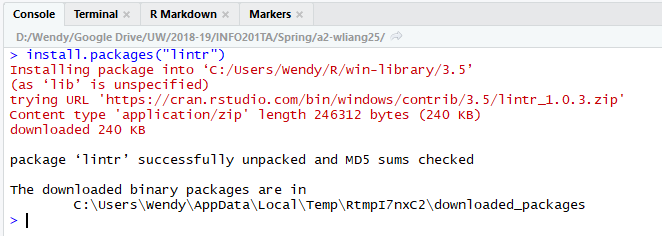
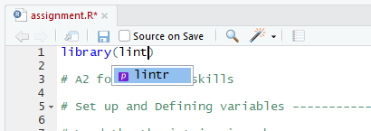
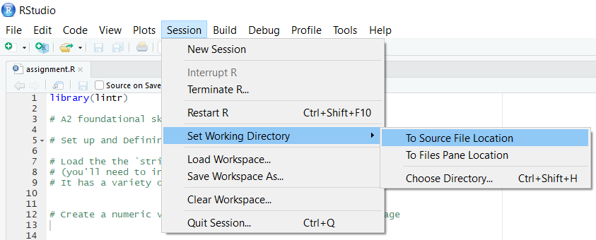
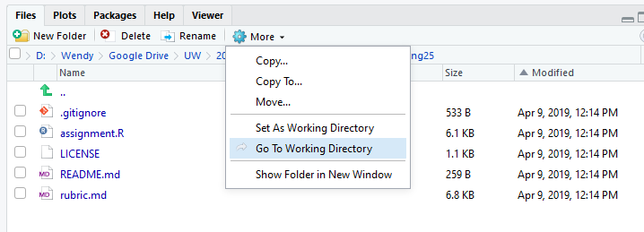
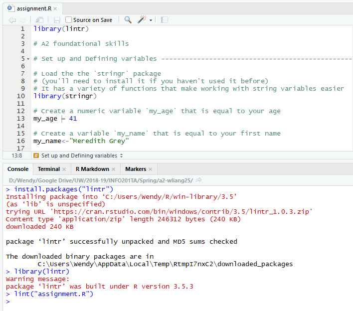
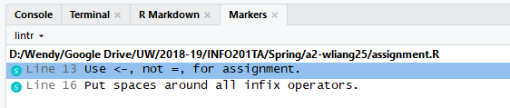

```{r, warning=FALSE, message=FALSE, echo=FALSE}
# Initial set up
library(knitr)
```

## Open up the file that you want to run the style check (lintr) on
For the following instructions, we'll be using assignment 2 as our example. After cloning the initial a2 repository, we can see that the default files located in our a2 repository are the
following:

- `.gitignore`
- `LICENSE`
- `README.md`
- `assignment.R`
- `rubric.md`

Go ahead and open up the `assignment.R` file in your RStudio.

## Install the lintr package and load the library
In your Console, **install the lintr package**: `install.packages("lintr")`

Remember that you only need to install packages once per computer. Because of such, there is no need to include this line of code in your scripts. But if you choose to include any `install.packages()`code in your script make sure you comment it out by using a `#` in front of the code: `# install.packages("lintr")`



Once the lintr package successfully downloads, at the top of your `assignment.R` script, **load the lintr library**: `library(lintr)`



*Note that the `assignment.R` tab is currently red with a `*` at the end of the file name. This means you haven't saved your file yet. Make sure you're always saving your updated files to see the most recent changes.

## Set your working directory
Often times you'll find yourself using file paths to load an image (think back to a1-news) or a dataset from a csv file. In these instances, you want to use a _relative path_ so other users can run your script (assuming they have access to your whole repo) and load the same images and datasets as you. 

To tackle the above problem, you want to **set your R session to your current working directory** (aka you want to set up your current R session so it starts reading file paths relative to the current folder/repository that you'll be working with - our a2 homework folder in this case). There are multiple ways to accomplish this, but one of the easiest ways by going to `Session` > `Set Working Directory` > `To Source File Location`:



After you've set your working directory to your source file (assignment.R) location, you'll notice that a `setwd()` function was ran in your console.

You can confirm that you've set your working directory to the correct folder by using the Files tab on the bottom right of your RStudio by going to `More` > `Go To Working Directory`:



If the files that show up in this window are the same files that were listed above, then that means you've set up your working directory correctly!

## Running lintr
Okay, cool. Now we can finally run lintr on some files to see if they've all been styled correctly using the `lint()` function. You can find more about the function using the `Help` tab or by typing in `?lint` in the console.

Let's say you've already added some code and editted the `assignment.R` file by answering some of the questions and now you want to see if you've styled your code correctly. In your console, run the `lint()` function by passing in a relative path to the file that you want linted: `lint("assignment.R")`



Now you might have noticed, RStudio opened up the `Markers` tab for you. In this tab, you'll be able to see the list of LintR issues that the style check caught. As we've mentioned in class and in the textbook, we should be using `<-` as an assignment operator instead of `=` which was done on `Line 13`. Another style check is to always put spaces around operators (exceptions are made for `^`) which was done on `Line 16`.



Once we fix these style errors, resave the file, and run the `lint()` function again. All the fixed lint errors will disappear!

**That's it! You should all now know how to run the lintr library to check the style of your code.**
